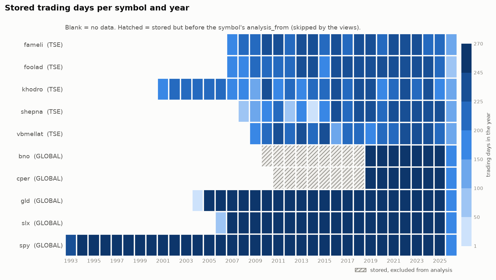

# Market Data Warehouse — TSE + Global Equities

An automated pipeline that ingests daily Tehran Stock Exchange and global bars into
PostgreSQL, updates idempotently, checks its own data, and exposes a clean SQL
analytics layer (adjusted prices, returns, volatility, correlation) plus a small app.


| | |
|---|---|
| Rows | 47,812 daily bars |
| Symbols | 10 (5 TSE, 5 global); 10 with data |
| Date range | 1993-01-29 to 2026-09-28 (34 calendar years) |
| Last data quality run | 0 ERROR, 636 WARN |

| symbol | ticker | market | rows | first | last | analysis from |
|---|---|---|---:|---|---|---|
| `fameli` | فملی | TSE | 4,296 | 2007-02-04 | 2026-09-28 |  |
| `foolad` | فولاد | TSE | 4,234 | 2007-03-11 | 2026-09-28 |  |
| `khodro` | خودرو | TSE | 5,289 | 2001-03-25 | 2026-09-28 |  |
| `shepna` | شپنا | TSE | 3,476 | 2008-06-29 | 2026-09-28 |  |
| `vbmellat` | وبملت | TSE | 3,691 | 2009-02-18 | 2026-09-28 |  |
| `bno` | BNO | GLOBAL | 4,105 | 2010-06-02 | 2026-09-25 | 2019-01-01 |
| `cper` | CPER | GLOBAL | 3,736 | 2011-11-15 | 2026-09-25 | 2019-01-01 |
| `gld` | GLD | GLOBAL | 5,497 | 2004-11-18 | 2026-09-25 |  |
| `slx` | SLX | GLOBAL | 5,016 | 2006-10-17 | 2026-09-25 |  |
| `spy` | SPY | GLOBAL | 8,472 | 1993-01-29 | 2026-09-25 |  |


<!-- stats:end -->

---

## Problem

Every later project in this series (stylized facts, backtests, factor research)
starts by re-downloading prices and re-inventing adjustments. That is slow,
irreproducible, and the source of silent bugs: a CSV quietly missing three months,
a capital increase read as a −53% crash, a symbol renamed.

This repo solves that once: **one database, one schema, one refresh command.**
Everything downstream reads from SQL, never from a CSV lying around in a folder.

## Data

| Source | Coverage | Library |
|---|---|---|
| Tehran Stock Exchange | daily bars, unadjusted, with TSE's final price and base price | `pytse-client` |
| Global (ETFs) | daily bars, raw close, dividends | `yfinance` (`auto_adjust=False`) |

The universe (`symbols.csv`): 5 TSE names from different industries (فولاد, فملی,
شپنا, خودرو, وبملت) and 5 global series chosen for their link to Iran: SPY (global
risk), GLD (gold), SLX (steel ↔ فولاد), CPER (copper ↔ فملی), BNO (Brent ↔ شپنا).

**Two traps this schema is built around**

- pytse's `adjClose` is TSE's official *final price*, **not** an adjusted close;
  Yahoo's `adj_close` *is* adjusted. Same name, different meaning, so neither is
  stored as "adjusted": `final_price` keeps TSE's number, adjustment happens in SQL.
- TSE resets a stock's base price (`yesterday` → `prev_final`) on capital increases,
  dividends and reopenings. Those resets *are* the corporate actions: on Foolad the
  8 reset days since 2022 give factors that reproduce TSE's own adjusted prices
  (e.g. 0.2029 and 0.0952 before 7 and 8 events).

## Schema

```
symbols            1 ─── * daily_bars                 corporate_actions (dividends)
  symbol_id PK            symbol_id, date   PK          symbol_id, date, action_type
  slug   UNIQUE           open high low close           amount
  market, vendor_id UQ    volume value trade_count
  ticker name sector      final_price prev_final      tse_price_limits
  currency is_active      source ingested_at            start_date PK, price_limit,
  analysis_from                                         evidence
                                                      data_quality_log
                                                        run_at, check_name, severity,
                                                        symbol_id, date, detail
```

- `slug` (Finglish, e.g. `fameli`) names files and CLI arguments; `vendor_id`
  (TSE InsCode or Yahoo ticker) is the identity used for upserts. `symbol_id` is a
  database-internal key and never leaves the database.
- Persian text is normalised on the way in: Arabic ك/ي/ى → Persian ک/ی (TSE sends
  Arabic forms; pytse's own ticker list uses Persian).

## Method

1. **Fetch → landing zone.** `fetch` saves each source's full history untouched
   (form may change, meaning may not) to `data/raw/{source}/{fetch_date}/{slug}.parquet`.
   Old snapshots stay as evidence of what the source said that day.
2. **Load (offline).** `load` reads the newest snapshot per symbol (falling back to
   `data/sample/`), maps it to one contract, and upserts on `(symbol_id, date)`,
   **updating only when a value actually differs**, so a rerun changes nothing and a
   source's restatement (e.g. Yahoo revising yesterday's volume) is picked up.
   Fetch and load never share a step, so a blocked source never blocks loading.
3. **Analytics layer: SQL, not pandas** (`sql/views.sql`)
   - `v_adjustment_events`: TSE base resets (`k = prev_final / previous final`) and
     dividends (`k = 1 − dividend / previous close`)
   - `v_adjusted_prices`: backward adjustment, price × product of every later `k`,
     via `EXP(SUM(LN(k))) OVER (ORDER BY date DESC ROWS … 1 PRECEDING)`; starts at
     each symbol's `analysis_from`
   - `v_returns`: simple and log returns with `LAG()`
   - `v_rolling_vol`: 20/60-day annualised volatility, NULL until a full window
   - `correlation_matrix(start, end)`: pairwise correlation of log returns
4. **Quality checks** after every load (`data_quality_log`, exit code 1 on any ERROR;
   data is never deleted):

   | ERROR (impossible) | WARN (suspicious, can be real) |
   |---|---|
   | price missing or ≤ 0; high < low; open/close outside [low, high] | move beyond the TSE limit of its era (event and reopen days skipped) |
   | TSE final price outside [min(low, base), max(high, base)] | gap > 10 days |
   | negative volume; dividend ≤ 0 or ≥ previous close | zero-volume day |
   | Arabic ك/ي/ى left in `symbols` | active symbol with no bar for 7+ days |

   The TSE limit changed over time (3% → 4% → 5% → 6% → 5% → 6% → 7% → 3%);
   `tse_price_limits.csv` records each era with its evidence (news or the data's
   own ceiling). Duplicate rows are impossible (primary key); a test proves it.

## Results

See the block at the top (rows, symbols, date range, quality summary, coverage
chart); it is regenerated from the database with `python -m warehouse readme`.

Verified along the way:

- Foolad adjusted prices vs TSE's own adjusted series: 1,038 days within ±0.06%
  (TSE rounds to whole rials). SPY vs Yahoo's `adj_close`: 8,472 days since 1993,
  max relative error 1.2e-6.
- A fresh clone + empty database + `init` + `update` loads everything, even with
  TSE unreachable (tested 2026-09-28, when TSETMC really was down).

## Limitations

- **TSE access needs an Iranian IP** (or split tunneling that resolves and routes
  `tsetmc.com` directly). pytse-client uses `old.tsetmc.com`, which is flaky.
  Without access, TSE symbols load from the sample and `stale_symbol` says how old it is.
- **Price-limit history is inferred** from one stock's data (Foolad) where no source
  was found (6% in early 2021, 7% from late 2022 to mid 2024); pre-2009 is unknown and
  skipped. The other four TSE stocks break the table 14–26 times each in 2009 (Foolad:
  2), so the 2009 boundary is probably wrong; those days are WARNs, not errors.
- **TSE annualisation uses 240 days/year**, an unverified assumption: one stock's own
  count (221–231) includes its halts. Measure the market calendar once more TSE
  symbols are loaded.
- **TSE/US correlation is same-calendar-day**: they share only Mon–Wed, and Tehran
  closes before New York opens, so same-day correlation understates the real link.
- **Yahoo's close is split-adjusted retroactively**: a future split rewrites history
  (L3 will update every row and log it).
- **Early CPER/BNO data has zero-volume days** (no trades, repeated last price), so
  their analysis starts 2019-01-01 (`analysis_from`); rows stay stored and checked.
- **Survivorship**: only today's symbols; delisted names are kept (`is_active = false`)
  but none were loaded. No intraday data.

## How to run

Prerequisites: Python 3.12, PostgreSQL 14+, an empty database (e.g. `marketdata`).

```bash
git clone https://github.com/amirmohamadazimi/market-data-warehouse.git
```
```bash
cd market-data-warehouse
```
```bash
uv sync
```
(or `python -m venv .venv`, activate it, and `pip install -r requirements.txt`)

```bash
cp .env.example .env
```
Edit `DATABASE_URL` in `.env`. Then two commands to a populated database:

```bash
python -m warehouse init
```
```bash
python -m warehouse update
```

`update` = fetch → load → check. Without an Iranian IP the TSE download fails with
a message and those symbols load from `data/sample/`.

Other commands:

```bash
python -m warehouse update --market TSE   # only TSE (e.g. with the VPN off)
python -m warehouse check                 # quality checks only
python -m warehouse symbols               # list the symbols
python -m warehouse symbols --add فملی --market TSE --slug fameli
python -m warehouse symbols --add GLD --market GLOBAL --slug gld --name "SPDR Gold Shares"
python -m warehouse sample                # refresh data/sample/ from the newest raw snapshots
python -m warehouse readme                # refresh the numbers and chart in this README
streamlit run app.py                      # the app: explore, data health, symbols
pytest
```

## Scope checklist

- [x] Ingestion: TSE (`pytse-client`) and global (`yfinance`) into one schema
- [x] Real schema: `symbols`, `daily_bars`, `corporate_actions`, with PKs and `(symbol, date)` indexes
- [x] Incremental and idempotent: full history is fetched (pytse has no start date), but only new or changed rows are written; a rerun changes nothing
- [x] SQL views: adjusted prices, simple + log returns, 20/60d rolling vol, correlation (a SQL function, since the window is a parameter)
- [x] CLI `python -m warehouse update`
- [x] Reads only from SQL: a Streamlit app (`app.py`) instead of a notebook
- [x] Quality checks: gaps, zero-volume days, limit-breaking moves, impossible prices; duplicates made impossible by the PK (tested)

## Done when

- [x] A stranger clones the repo, runs two commands, and has a populated database
- [x] Every return series is computed in SQL with a window function, not in pandas
- [x] This README shows one chart and states how many rows, symbols, and years it covers

## Stack

Python · pandas · SQLAlchemy · PostgreSQL · parquet · argparse · Streamlit · matplotlib · pytest
